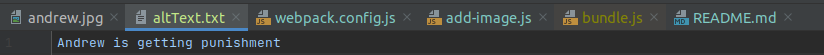
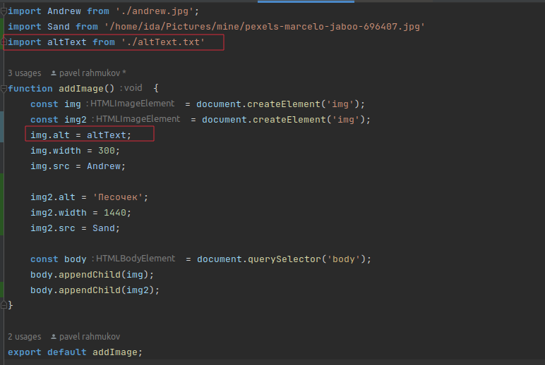
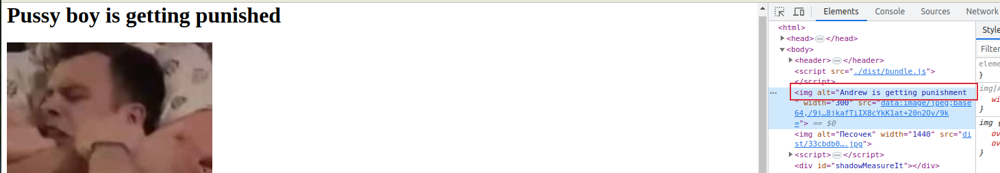

# webpack
in this repository I study featurse of webpack

## I've made my first webpack.config.js
- #### I've learned about input and output settings. In output setting I defined two fileds `path` - which consists name of dir where will be your bundle and `publickPath` - which defines path to your files.
- #### I've found out about modes: `production` `development`, but created my custom config
- #### I've learned about `asset modules` which inclide 4 different types:
  - `asset/resource` - put your files separatly from bundle.js
  - `asset/inline` - put your files into js bundle - increace your bundle.js. Fit for small svg files because of when you set `asset/inline` images embedded into js and don't call http request
  - `asset` - webpack defines itself which files are `asset/resource` and which files are `asset/inline`. If weight of file **less than 8kb** then it's `asset/inline` else it's `asset/resource`.
     #### We can set your own file weight `maxSize` to define type of asset:
     ```
        module: {
           rules: [
              {
                 test: /\.(png|jpg)$/,
                 type: 'asset',
                 parser: {
                    dataUrlCondition: {
                       maxSize: 3 * 1024 // 3 kb
                    }
                 },
              }
           ]
        } 
    ```
  - `asset/source` - need for inject content of files into JavaScript
    1. look at content file 
    2. import this text file in our `add-image` function 
    3. look at result  
